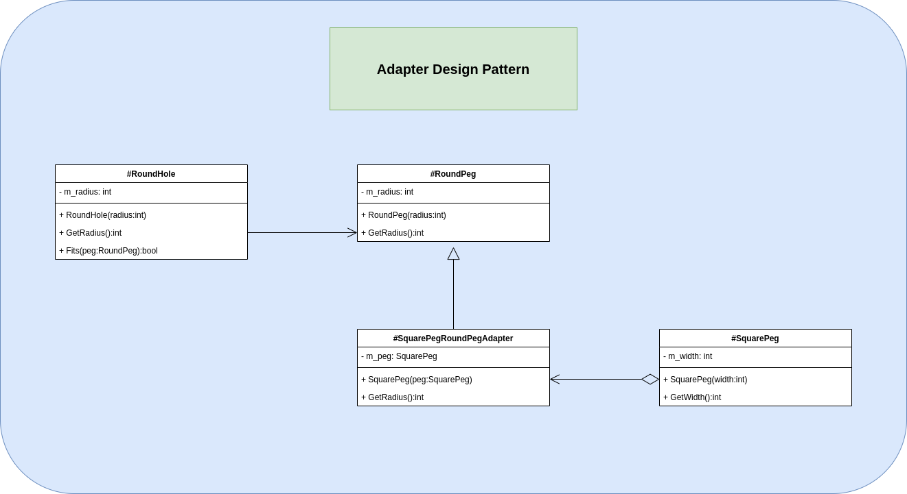

# Adapter

It is a special object which converts the interface of one object so that another object can understand it.

The example program consist of a round hole which accepts round peg. However, we have a square peg and we want to check if it can be introduced.

So, an adapter for square pegs are build. This adapter has an agregation with square pegs class to use it, and inherence the round peg class to modify the method which is called in round hole class.

## Architecture

